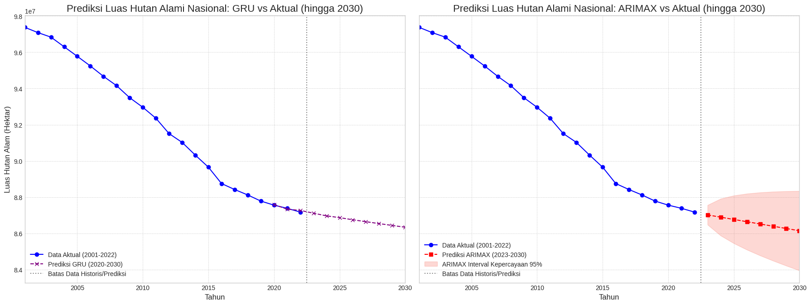
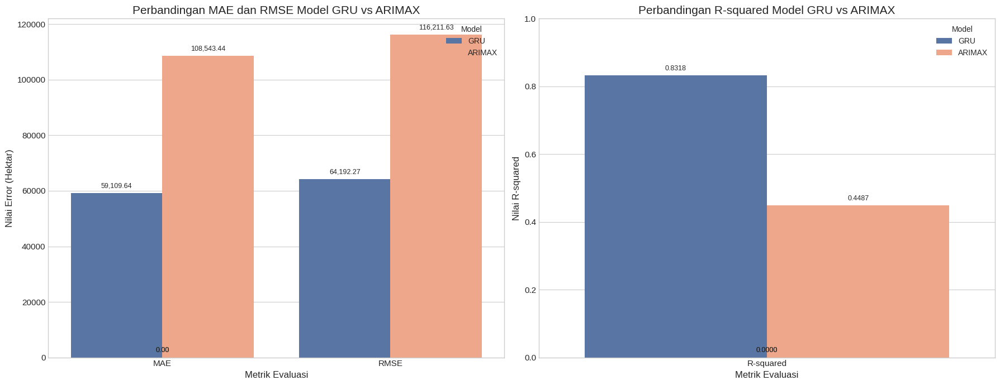

# Prediksi Perubahan Luas Hutan Alam di Indonesia Menggunakan ARIMAX dan GRU

**Tugas Besar Machine Learning - Institut Teknologi Sumatera**

## Deskripsi Singkat Proyek

Proyek ini fokus untuk memprediksi perubahan luas hutan alam di Indonesia menggunakan dua pendekatan yang berbeda: model statistik klasik ARIMAX dan model deep learning GRU. Dataset yang digunakan mencakup data historis luas hutan alam dan laju deforestasi per provinsi dari tahun 2001-2022.

Latar belakang masalah ini muncul karena hutan Indonesia terus mengalami penyusutan akibat deforestasi. Padahal hutan Indonesia punya peran vital sebagai "paru-paru dunia" dan habitat keanekaragaman hayati. Dengan model prediksi yang akurat, diharapkan bisa membantu pemerintah dalam merumuskan kebijakan pengelolaan hutan yang lebih efektif.

## Penjelasan Dataset

### Sumber Dataset
- **Sumber:** Trase Earth (website resmi untuk tracking supply chains)
- **URL:** [Spatial metrics - Indonesia - remaining forest](https://www.trase.earth/)
- **Period:** 2001-2022 (22 tahun data historis)

### Deskripsi Dataset
- **Total Entri:** 748 entri data
- **Jumlah Provinsi:** 34 provinsi di seluruh Indonesia
- **Jumlah Kolom:** 8 kolom utama

### Struktur Data
| Kolom | Deskripsi | Tipe Data |
|-------|-----------|-----------|
| `year` | Tahun observasi (2001-2022) | Integer |
| `country` | Negara (Indonesia) | Object |
| `region` | Nama provinsi | Object |
| `parent_region` | Wilayah induk/pulau (Sumatera, Kalimantan, dll) | Object |
| `natural_forest_area_hectares` | Luas hutan alam dalam hektar | Float |
| `deforestation_hectares` | Laju deforestasi tahunan dalam hektar | Float |

### Karakteristik Dataset
- **Tidak ada missing values** pada kolom utama
- **Rata-rata luas hutan:** ~2.7 juta hektar per provinsi per tahun
- **Rata-rata deforestasi:** ~13.9 ribu hektar per provinsi per tahun
- **Variabilitas tinggi** antar provinsi (Papua dan Kalimantan dominan)

## Algoritma yang Digunakan

### 1. ARIMAX (Autoregressive Integrated Moving Average with Exogenous Variables)
- **Jenis:** Model statistik klasik untuk time series forecasting
- **Keunggulan:** 
  - Mudah diinterpretasi secara statistik
  - Cocok untuk data yang memiliki pola linear dan stasioner
  - Dapat memperhitungkan variabel eksternal (deforestasi)
- **Parameter:** p=1, d=0/1/2 (berdasarkan uji stasioneritas), q=1

### 2. GRU (Gated Recurrent Unit)  
- **Jenis:** Deep learning model untuk sequence modeling
- **Keunggulan:**
  - Mampu menangkap pola non-linear yang kompleks
  - Efektif untuk dependensi temporal jangka panjang
  - Lebih sederhana dibanding LSTM tapi performa hampir sama
- **Arsitektur:** 
  - Input layer (2 timesteps × 2 features)
  - GRU layer (32 units)
  - Dense layer (16 units)
  - Output layer (1 unit)

### Alasan Pemilihan
Kedua model dipilih untuk membandingkan pendekatan klasik vs modern dalam time series forecasting. ARIMAX mewakili metode statistik yang mapan, sementara GRU mewakili pendekatan AI terkini yang bisa menangkap pola kompleks.

## Panduan Menjalankan Kode

### Prasyarat
```bash
# Install Python 3.8+ dan dependencies
pip install pandas numpy matplotlib seaborn
pip install scikit-learn tensorflow keras
pip install statsmodels joblib
```

### Struktur Folder
```
Unnamed-Final_Project/
├── data/
│   ├── spatial-metrics-indonesia-remaining_forest_province.csv
│   └── spatial-metrics-indonesia-territorial_deforestation_province.csv
├── notebooks/
│   └── main.ipynb
├── src/
|   ├── evaluasi-matrix.png
|   ├── prediksi-luas-hutan.png
|   ├── Breakdown MAE.png
|   ├── Breakdown RMSE.png
│   ├── model_gru_forest.h5
│   ├── scaler_gru.pkl
│   └── tes.py
├── LICENSE
├── README.md
├── app.py
├── requirements.txt
└── Unnamed-Final-Report.pdf
```

### Langkah-langkah Eksekusi

1. **Clone Repository**
   ```bash
   git clone [https://github.com/bintangfikrif/Unnamed-Final_Project.git]
   cd Unnamed-Final_Project
   ```

2. **Persiapan Environment**
   ```bash
   pip install -r requirements.txt
   ```

3. **Jalankan Notebook**
   ```bash
   jupyter notebook
   # Buka file notebooks/main.ipynb
   ```

4. **Eksekusi Kode**
   - Jalankan cell preprocessing untuk persiapan data
   - Jalankan cell training untuk ARIMAX dan GRU
   - Jalankan cell evaluation untuk melihat hasil perbandingan
   - Jalankan cell visualization untuk plot prediksi

### Konfigurasi
- **Data path:** Sesuaikan path dataset di bagian awal notebook
- **Model parameters:** Bisa disesuaikan di section model building
- **Prediction horizon:** Default sampai 2030, bisa diubah sesuai kebutuhan

## 📈 Hasil Output dan Visualisasi

### Metrik Evaluasi
```
Model Performance Comparison (2020-2022):

ARIMAX:
- RMSE: 116,211.63 hektar
- MAE: 108,543.44 hektar  
- R²: 0.4487 (44.87%)

GRU:
- RMSE: 66,698.91 hektar
- MAE: 57,383.70 hektar
- R²: 0.8184 (81.84%)

GRU menang telak dengan improvement:
- RMSE: 42.6% lebih baik
- MAE: 47.1% lebih baik  
- R²: 82.4% lebih baik
```

### Komparasi Perbandingan Hasil Metrik Evaluasi


### Hasil Prediksi
```
Proyeksi Luas Hutan Nasional:

Tahun 2023:
- ARIMAX: 87,024,287 hektar
- GRU: 87,083,810 hektar

Tahun 2030:
- ARIMAX: 86,150,832 hektar  
- GRU: 86,267,530 hektar

Trend: Kedua model memprediksi tren penurunan sekitar 800-900 ribu hektar dalam 8 tahun ke depan 
```

### Visualisasi Utama

1. **Plot Perbandingan Historical vs Prediction**
   
   - Garis biru: Data historis 2001-2022
   - Garis merah: Prediksi ARIMAX 2023-2030 (dengan confidence interval)
   - Garis hijau: Prediksi GRU 2023-2030

2. **Grafik Perbandingan Metrik**
   
   - Bar chart comparison RMSE, MAE, dan R² antara kedua model
   - Jelas terlihat GRU unggul di semua metrik

## Key Findings

- **GRU >> ARIMAX** dalam hal akurasi prediksi
- Kedua model konsisten memprediksi **tren penurunan** luas hutan
- **Papua dan Kalimantan** masih jadi provinsi dengan hutan terluas
- **Deforestasi tertinggi** di Kalimantan Barat dan Riau
- Model bisa jadi tools yang berguna untuk **policy making** di bidang kehutanan

## Tim Pengembang

- Bintang Fikri Fauzan (122140008) - Project Leader & Design Researcher - @bintangfikrif
- Cindy Nadila Putri (122140002) - Data Analyst & Engineer - @cindynadilaptr
- Ferdana Al Halkim (122140012) - ML Engineer - @luciferdana
- M. Fakhri Nur (122140034) - Documentation & GitHub Manager - @Sovenable
- Rafki Haykhal Alif (122140035) - ML Engineer - @RafkiHaykhalAlif
- Arkan Hariz C. Liem (122140038) - Evaluator & Results Visualizer - @ArkanHariz
- Naufal Haris N. (122140040) - Data Analyst & Engineer - @Harisskh

